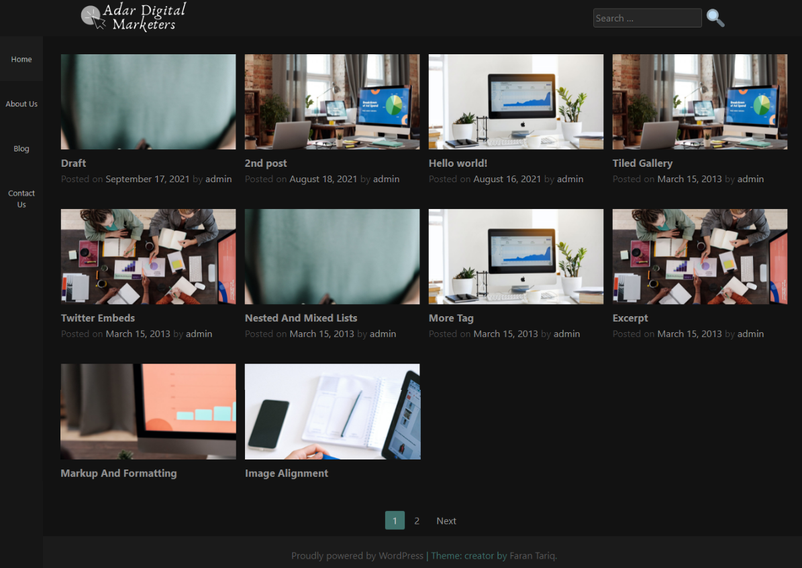

CreatorWP is a highly customizable WordPress Theme Developed by Faran Tariq.

## Installation
To use this theme for your WordPress site:
1. Download the zip file of this theme from github.
2. In your WordPress Installation go to Appearance > Themes
3. Click "Add New"
4. Click "Upload Theme" and select this theme's zip file(creatorwp.zip)
5. Activate the theme.

